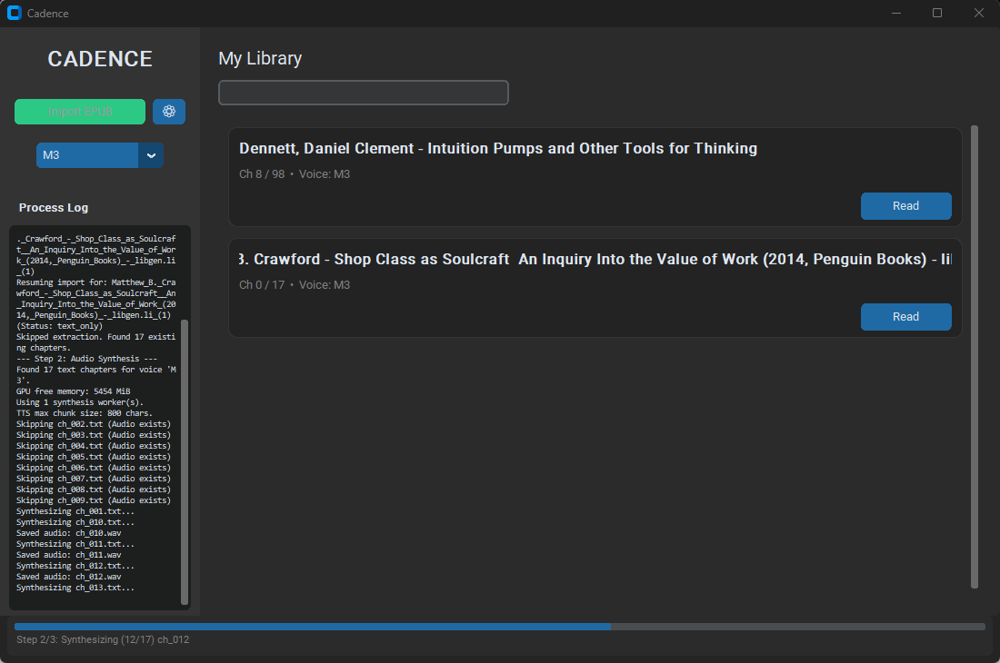

# Cadence
Cadence is an immersive reading pipeline: **EPUB -> chapter text -> audiobook audio -> word-level synced reader data**.

## What It Does
- Imports EPUB files and extracts ordered chapter text.
- Synthesizes chapter audio with Supertonic TTS.
- Aligns audio to text with WhisperX for word timestamps.
- Plays back in a synced reader/player UI.
- Processes chapters in a streaming pipeline so reading can start before full import completes.

## Pipeline
1. EPUB extraction (Calibre) -> `library/<book>/content/ch_XXX.txt`
2. Per chapter: TTS synthesis (Supertonic) -> `library/<book>/audio/ch_XXX.wav`
3. Per chapter: Alignment (WhisperX) -> `library/<book>/content/ch_XXX.json`
4. Player can read chapters as soon as each chapter has audio + alignment.

## Import Behavior (Important)
- Cadence now runs **chapter-by-chapter interleaved processing**:
  - If a chapter already has `.wav`, Cadence skips synthesis and aligns it.
  - If `.wav` is missing, Cadence synthesizes first, then aligns.
  - If `.wav` and `.json` both exist, Cadence skips that chapter.
- This makes resume robust after interruptions and enables immediate reading while import is still running.
- Library cards update live with ready counts (`Audio x/y`, `Alignment x/y`) during import.

## Media


## Requirements
- Windows 10/11
- Python 3.12
- Calibre (`ebook-convert.exe`) installed at:
  - `C:\Program Files\Calibre2\ebook-convert.exe`
- NVIDIA GPU recommended for faster TTS/ASR

## Install
### 1) Main App Environment
```powershell
python -m venv venv
.\venv\Scripts\Activate.ps1
python -m pip install --upgrade pip
pip install -r requirements.txt
```

If you use a separate WhisperX venv, point Cadence to it:
```powershell
$env:CADENCE_WHISPERX_PYTHON="C:\Users\mateo\Desktop\Cadence\venv_whisperx\Scripts\python.exe"
```

## Run
```powershell
.\venv\Scripts\Activate.ps1
python main.py
```

Debug mode:
```powershell
python main.py --debug
```

## Configuration
Cadence uses `cadence_settings.json` (managed from the UI settings cog next to **Import EPUB**).

- Settings are persisted automatically when you click **Apply**.
- Settings are applied immediately to the current app process.
- `CADENCE_*` environment variables are still usable for one-off CLI/script runs.

Useful keys:
- `CADENCE_EXTRACT_WORKERS`
- `CADENCE_SYNTH_WORKERS`
- `CADENCE_TTS_MAX_CHARS`
- `CADENCE_FORCE_CPU`
- `CADENCE_CUDA_ONLY`
- `CADENCE_WHISPERX_MODEL`
- `CADENCE_WHISPERX_BATCH_SIZE`
- `CADENCE_WHISPERX_COMPUTE_TYPE`
- `CADENCE_WHISPERX_DEVICE`
- `CADENCE_WHISPERX_PYTHON`
